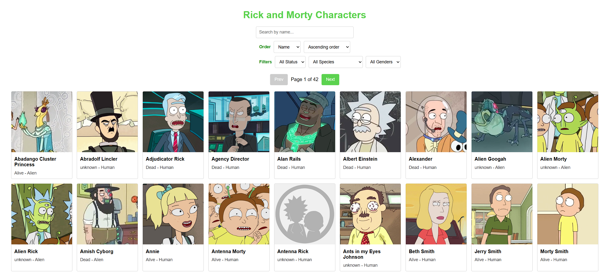
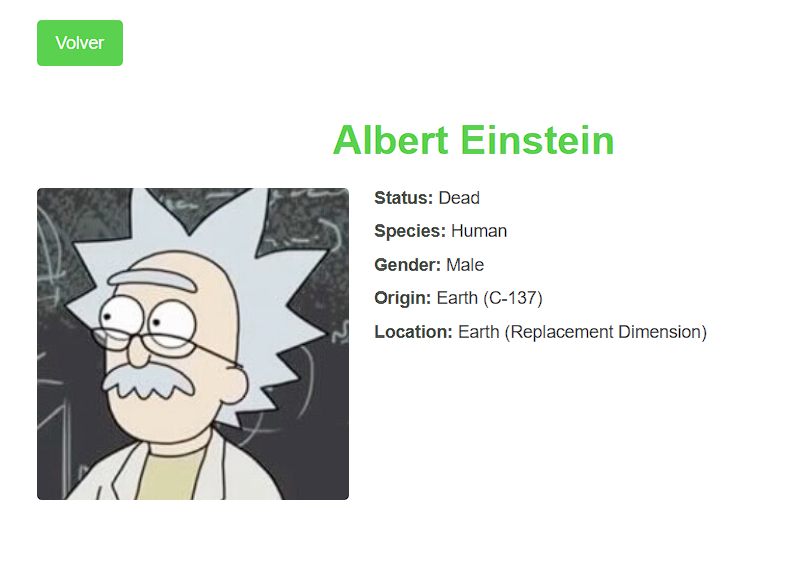
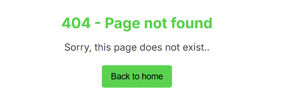

# Welcome to Appspace React FE Challenge

## Installation & Setup

1. **Clone the repository:**

   ```bash
   git clone https://github.com/alferto82/rick-morty
   cd rick-morty
   ```
2. **Install dependencies:**

   ```bash
   yarn install
   ```
3. **Run the application in development mode:**
(The app will be available at http://localhost:3000)
   ```bash
   yarn start
   ```
4. **Run tests:**
   ```bash
   yarn test
   ```
5. **Build for production:**
   ```bash
   yarn build
   ```

## Usage

After starting the application in development mode, the home page displays a list of Rick and Morty characters.

 You can:

- **Search:** Enter a name in the search box to filter characters by name.


- **Order:** Select an order field (Name, Status, Species, or Gender) and choose the direction (Ascending or Descending) to sort the list.


- **Filter:** Use the additional filters to filter results by status, species, or gender.


- **Pagination:** Navigate through pages using the pagination controls at the top and bottom of the list.


- **View Details:** Click on a character card to open a detailed view with more information about the selected character.



- **404 Page:**
I have implemented a 404 Not Found page that is displayed whenever a user navigates to an undefined route



## Architecture & Rationale
This application was built following the principles of Clean Architecture. Here are the main reasons for choosing this approach:

### Separation of Concerns:
Application is divided into distinct layers (domain, data and presentation), ensuring that each layer handles a specific responsibility. This separation reduces coupling and makes the code easier to understand and maintain.

### Scalability & Maintainability:
Isolating business logic in the domain layer and delegating data fetching to the data layer means you can modify or extend features without impacting other parts of the application. This is especially beneficial when this project grows.

### Testability:
The clear separation of layers makes unit and integration testing much easier. Domain logic, repositories, and UI components can be tested in isolation.

### Reusability & Flexibility:
UI components and custom hooks are developed in a modular way, allowing them to be reused across the application. This improves consistency and reduces code duplication.

### Performance Optimization:
With well-defined layers, it's possible to apply optimization strategies at each level. For example, the data layer implements in-memory caching to avoid redundant API requests, while the presentation layer is optimized using techniques such as React.memo, useCallback, and useMemo to reduce unnecessary re-renders.

### Future Changes:
Clean Architecture facilitates the integration of new technologies or improvements without having to drastically restructure the entire application. This ensures that the project remains robust and adaptable over time.

This architectural approach ensures that the project is robust, scalable, and easy to maintain, making it well-suited to evolve and accommodate new requirements in a controlled manner.

```
src/
├── domain/               // Business logic
│   ├── entities/         // Define your models and types 
│   ├── usecases/         // Business logic 
│   └── repositories/     // Interfaces for repositories 
│
├── data/                 // Data access
│   ├── datasources/      // API calls or data source implementations 
│   ├── repositories/     // Implementations of domain repository interfaces 
│   └── cache/            // Cache services and implementations 
│
├── presentation/         // UI layer
│   ├── components/       // Reusable UI components 
│   ├── hooks/            // Custom hooks 
│   ├── pages/            // Main pages or views 
│   └── styles/           // Global styles, theme, and style files 
│
└── test-helpers/         // Test data and mocks
```

## Caching Strategy
To improve performance and reduce redundant API calls, this application implements an in-memory caching strategy within the data layer.

### List Cache:
Stores search results by combining filters and page number into a unique key. This way, repeated queries return cached data.

### Character Cache:
Each character is cached by ID. If the character data was already retrieved in a list, the detail view can access it from the cache without making another network request

> **Note:** I could have used react-query for caching and data fetching, but I opted not to use third-party libraries.

## Deployment

This project is deployed on Heroku. The live application can be accessed at:

[https://rick-morty-98c582bbf214.herokuapp.com/](https://rick-morty-98c582bbf214.herokuapp.com/)
